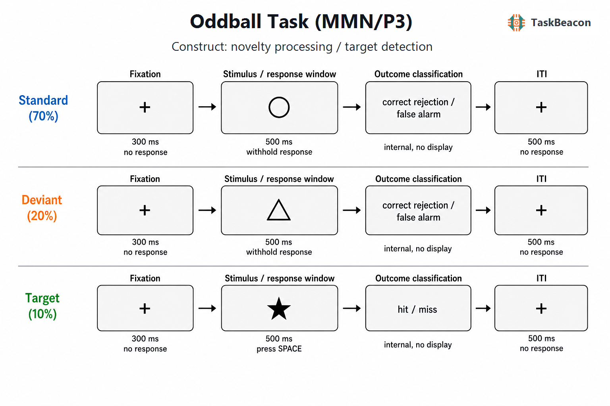

# 三刺激视觉 Oddball 范式：偏差检测、目标加工及其电生理解释边界

Oddball 范式所处理的核心方法学问题，是在连续刺激流中区分由事件概率、知觉偏差与任务相关性引起的加工变化。频繁标准刺激建立局部规律，低概率事件违反该规律；当一类低概率事件还要求作答时，实验者可进一步比较自动变化检测、注意定向、目标分类与反应选择。三刺激设计以频繁标准、罕见非目标偏差和罕见目标构成，使“罕见性”与“目标性”获得部分分离，因而成为研究失配负性（mismatch negativity, MMN）、P3a 和 P3b 的常用事件相关电位（event-related potential, ERP）范式。不过，低概率刺激引起的差异波并不天然等同于 MMN，P3 波幅也不是单一认知能力的直接读数。严谨解释须把刺激物理属性、概率、注意要求、反应规则和测量时间窗同时纳入。

## 1. 范式提出与理论背景

Squires、Squires 与 Hillyard（1975）在不可预测声音序列中区分了两类长潜伏期正波：与新异事件相关、分布较前的成分，以及与任务目标相关、顶叶优势的成分。这一结果奠定了后来 P3a/P3b 区分及三刺激 oddball 的实验基础。P3a 通常在罕见非目标或新异刺激后出现，反映刺激驱动的注意定向及其后的控制调整；P3b 通常由需分类或报告的低概率目标诱发，涉及任务相关证据评价和当前情境表征的更新（Comerchero & Polich, 1999; Polich, 2007）。二者均受概率、可辨别性、任务难度和资源分配影响，不能仅凭正波潜伏期或单个电极命名。

MMN 的历史线索与 P3 有所不同。Näätänen、Gaillard 与 Mäntysalo（1978）对选择性注意效应的重新解释推动了对较早期偏差相关负波的识别；后续研究将听觉 MMN 界定为规则建立后由可辨别变化诱发、在没有主动报告时仍可观察的差异成分（Näätänen et al., 2007）。视觉失配负性（visual mismatch negativity, vMMN）随后扩展至颜色、方向、形状、运动及抽象序列规则。其预测加工解释认为，偏差事件与已形成的视觉规律不一致，诱发与预测误差相关的后部负向差异，但重复抑制、神经适应和物理刺激差异也能产生相似效应（Stefanics et al., 2014）。因此，主动三刺激视觉 oddball 可以同时研究目标 P3b 和非目标偏差 P3a；只有在注意与物理差异得到适当控制时，偏差减标准的早期负波才适合称为 vMMN。

二刺激 oddball 通常把罕见性、目标性和按键要求集中在同一条件，所得差异难以归属于单一加工过程。三刺激版本增加罕见非目标条件后，可用偏差减标准估计概率违反和定向相关变化，用目标减偏差在两者同为低概率时突出任务相关性与反应要求。该分解仍是不完全的：目标与偏差的物理特征、主观显著性和条件概率往往不同，且偏差引发的注意捕获会影响随后的目标准备。范式价值来自受约束的对比结构，而非某一条件与某一心理构念的一一映射。

## 2. 任务逻辑、流程与核心参数

经典三刺激 oddball 包含高概率标准刺激、低概率非目标偏差刺激和低概率目标刺激。三类刺激以伪随机或受约束随机顺序呈现，通常限制连续目标或连续偏差，并保证每类条件具有足够的无伪迹试次。参与者对目标按键或计数，对标准与非目标偏差不反应。每个试次由注视、短时刺激/反应窗及刺激间隔组成；刺激持续时间、刺激起始异步、条件概率和目标—标准可辨别性需在实验内固定，并在跨组比较时一致报告（Duncan et al., 2009）。低概率本身不会指定成分：非目标偏差减标准主要检验偏差检测与注意定向，目标减标准主要检验目标评价和情境更新。

序列设计还决定参与者实际学习到的规律。完全随机抽样可能产生连续稀有事件或局部概率波动，使同一标签在不同区块具有不同的条件历史；受约束随机化则应预先规定最短标准间隔、首试次条件及各条件确切数量。ERP 研究需在刺激显示的首个刷新帧发送条件标记，并把按键与未反应事件分开编码，以便建立刺激锁定与反应锁定数据。若反应窗短于潜在决策时间，漏报会混合检测失败和超时；若刺激持续时间与反应窗完全重合，较慢反应也将被系统排除。

行为指标应与反应规则对应。目标命中率、漏报率和目标反应时刻画目标检测；标准与偏差条件的误报率反映反应抑制及规则维持。若需要区分敏感性与反应偏向，可由目标命中和非目标误报估计信号检测指标 *d′* 与判定标准。总体正确率容易受标准试次数量支配，在标准比例很高时可能掩盖目标漏报。ERP 分析则通常计算目标减标准和偏差减标准差异波，并预先规定电极簇、基线、时间窗与伪迹规则。目标按键会叠加反应准备和运动电位，故 P3b 的刺激锁定结果宜结合反应时、反应锁定分析或无按键计数版本判断。

## 3. 主要行为与神经科学发现

### 3.1 偏差检测、注意定向与目标分类

三刺激设计的主要价值来自两个可区分对比。偏差非目标相对于标准同样罕见却不要求反应，其差异较多反映新异性、注意捕获及对当前任务集的干扰；目标相对于标准同时改变概率与任务相关性，其 P3b 更接近目标分类和情境更新。Comerchero 与 Polich（1999）发现，听觉和视觉条件下的 P3a/P3b 分布还会随目标—标准辨别难度改变，说明“额中央 P3a—顶叶 P3b”的划分具有条件依赖性。P3b 潜伏期通常随刺激评价时间延长，波幅则受目标概率、主观显著性和可用注意资源共同调节（Polich, 2007）。行为速度、正确率与 P3 指标因而提供互补信息，但任一指标均不能单独定位信息加工阶段。

对于 vMMN，关键操作是在偏差刺激与标准刺激均不属于当前目标时检验早期后部差异，并排除物理差异和注意捕获。视觉规律可基于单一特征或序列关系形成；偏差后的负向差异支持对规律违反的快速编码，但标准的高重复次数同时引起刺激特异性适应（Stefanics et al., 2014）。精神和神经疾病研究的综述也显示，vMMN 的时间窗、拓扑和效应量随刺激特征与控制条件明显变化（Kremláček et al., 2016）。因此，在目标检测任务中发现偏差减标准负波，可以称为“偏差相关负向差异”；若没有等概率控制、角色反转或独立控制刺激，不宜据此排他性推断预测误差。

### 3.2 EEG 与 fMRI 的互补证据

EEG 揭示了从早期偏差检测到后期目标评价的时间展开。MMN/vMMN 通常早于 P3，P3a 随罕见非目标引起的定向出现，P3b 在目标分类后达到顶叶最大。ERP CORE 以标准化任务、公开数据和预注册式计分参数证明，包括视觉 P3 在内的常见成分可用紧凑范式稳定诱发，同时强调成分量化依赖时间窗、电极和预处理选择（Kappenman et al., 2021）。头皮电位能够约束加工先后，却不能凭拓扑直接确定皮层源。

成分时间窗必须依据模态、年龄和任务难度设定。视觉刺激的早期感觉成分可能与偏差相关负波重叠，P3a 与 P3b 也可能形成宽广而连续的正向活动。峰值搜索在低信噪比条件下容易选择噪声极值，预先确定的区域均值和平均振幅通常更适合组间及个体差异研究（Duncan et al., 2009; Kappenman et al., 2021）。差异波增强了条件特异性，却把两个条件各自的测量误差合并；研究者仍应展示各条件波形及其有效试次数。

功能磁共振成像（functional magnetic resonance imaging, fMRI）从空间层面显示，oddball 效应涉及感觉区、岛叶/额盖、前扣带及额顶注意网络，而非一个独立的“偏差检测中心”。跨听觉和视觉研究的荟萃分析表明，低概率事件稳定招募腹侧注意网络，并随任务要求共同调动背侧额顶区域；感觉皮层活动则具有模态特异性（Kim, 2014）。结合 fMRI 与 ERP 的研究进一步把前扣带活动与 N2b–P3a 时段的注意调节联系起来，并显示视觉与听觉感觉区在该时段前后参与加工（Crottaz-Herbette & Menon, 2006）。这些结果支持分布式网络参与偏差和目标加工，但 BOLD 共激活及 fMRI 约束的源模型都不足以证明某一区域对 P3 或行为表现具有因果作用。

## 4. 范式发展与主要应用

Oddball 参数已从简单音调扩展至图形、面孔、语义类别和多感觉事件，并用于发展、衰老及精神病性障碍研究。生命周期荟萃分析显示，P300 波幅和潜伏期随年龄呈非线性变化，儿童成熟与老年阶段的变化方向和速率不同；因此年龄、感觉能力和任务难度须进入组间模型，而不能把偏离青年常模直接解释为病理（van Dinteren et al., 2014）。

临床应用中，听觉 MMN/P3a 在精神分裂症多中心研究中表现出可测量的群体差异，并与认知及功能指标相关，但人口学因素、站点和数据质量会改变幅度估计（Light et al., 2015）。视觉 oddball 研究亦在临床高风险人群中观察到较小且潜伏期较长的 P300，纵向结果提示该差异可持续存在，但小样本研究尚不足以建立个体转归预测（Oribe et al., 2020）。近期 vMMN 荟萃分析汇总 10 项精神分裂症谱系研究，得到患者振幅降低的中等合并效应，同时指出范式与样本异质性仍显著（Mazer et al., 2024）。这些证据支持 oddball ERP 作为群体研究和候选分层指标，不支持把一次任务结果直接用作诊断。

## 5. 测量效度与解释边界

可靠性取决于成分、计分方式、试次数和重复间隔。四次测量的听觉 MMN 研究报告频率与时长 MMN 的平均组内相关分别约为 0.73 和 0.70，但样本仅 16 人，且不能直接外推至视觉图形版本（Wang et al., 2021）。2025 年 AMP SCZ 多中心研究在临床高风险者和社区对照中同时测量听觉/视觉 P3a、P3b 与听觉 MMN，多数 EEG 指标的两月重测广义系数达到良好至优秀范围；视觉 P3a、视觉 P3b 同时出现跨区块或跨测量衰减，说明可靠的个体排序可以与均值习惯化并存（Mathalon et al., 2025）。因此，重复测量研究需要固定区块位置、控制练习与疲劳，并分别报告内部一致性、重测信度和均值稳定性。

构念效度的首要限制是条件差异不纯。目标减标准混合了物理属性、概率、注意、决策和按键；偏差减标准混合了物理差异、概率、适应和规律违反。视觉任务若以不同颜色和形状分别代表三条件，还会引入低级知觉显著性。等概率控制、标准—偏差角色反转、跨条件物理刺激平衡及独立注意任务可增强 vMMN 的可识别性（Stefanics et al., 2014）。对 P3，则应匹配可辨别性并分析目标概率、正确试次、反应时和错误类型。测量标准化指南还要求报告有效试次数、参考电极、滤波、基线、伪迹剔除和量化窗，因为分析自由度可改变波幅及组间效应（Duncan et al., 2009）。

群体水平效应、个体排序可靠性与临床效度需要分别验证。稳定的组平均 P3 并不保证差异分数具有足够重测信度；较高重测系数也不能证明指标对疾病特异，或能够在新样本中预测转归。临床建模应在独立队列中预先规定阈值、校准误差和增量效度，并检验年龄、药物、视力、疲劳和共病的影响。现有证据最适合支持标准化 oddball 指标进入多模态研究，而非作为孤立的个体诊断依据。

## 6. TaskBeacon 中的任务实现

### 6.1 任务资源与访问入口

| 资源 | ID | 用途 | 地址 |
|---|---|---|---|
| 完整实验实现 | T000018 | PsychoPy/PsyFlow EEG 采集任务 | [源代码](https://github.com/TaskBeacon/T000018-oddball-mmn) |
| 浏览器预览源码 | H000018 | 缩短区块数的行为型网页预览，不含 EEG 采集 | [源代码](https://github.com/TaskBeacon/H000018-oddball-mmn) |

截至核验时，两个公开源仓库均可访问；未发现可验证的直接公网运行地址。H000018 的仓库说明明确其区块数为预览而缩短，不能替代 T000018 的 EEG 采集版本。

### 6.2 实现流程与关键参数

TaskBeacon 当前版本采用三刺激视觉 oddball。每个区块按权重随机生成条件，并将首个试次稳定为标准条件；任务没有阶梯或反应时自适应控制。

| 项目 | 当前实现 |
|---|---|
| 结构 | 3 区块，每区块 90 试次，共 270 试次 |
| 条件与刺激 | 标准○ 70%；偏差△ 20%；目标★ 10% |
| 试次时序 | 注视 300 ms；刺激及反应窗 500 ms；试次间隔 500 ms |
| 反应规则 | 仅目标按空格；标准与偏差不反应 |
| 计分与结局 | 命中或正确拒绝记 1 分；漏报或误报记 0 分；无逐试次反馈 |
| 主要记录 | 条件、按键、反应时、命中/漏报/误报/正确拒绝、正确性与事件标记 |

**图 1. TaskBeacon 当前 EEG 实现的试次流程。** 三类试次均先呈现中央注视点 300 ms，随后进入 500 ms 的刺激与反应窗：标准条件呈现白色圆形（70%），偏差条件呈现黄色三角形（20%），两者均要求抑制按键；目标条件呈现红色五角星（10%），要求在该窗口内按空格键。目标按键与未按键分别归为命中和漏报，非目标未按键与按键分别归为正确拒绝和误报；分类仅写入数据，不呈现逐试次反馈。其后为 500 ms 注视形式的试次间隔。条件按权重随机生成，区块首试次固定调整为标准条件，无在线阈值或阶梯更新。

该实现直接支持目标命中率、非目标误报率、目标反应时以及目标/偏差相对标准的 ERP 对比。由于三种条件同时改变形状与颜色，且偏差刺激处于主动目标检测序列，偏差减标准同时包含知觉显著性、概率和注意定向效应。现有实现适合表述为 P3a/P3b 风格的三刺激视觉 oddball；若研究目的专门指向 vMMN 的预测误差解释，仍需增加物理刺激平衡或等概率控制条件。

## 参考文献

Comerchero, M. D., & Polich, J. (1999). P3a and P3b from typical auditory and visual stimuli. *Clinical Neurophysiology, 110*(1), 24–30. https://doi.org/10.1016/S0168-5597(98)00033-1

Crottaz-Herbette, S., & Menon, V. (2006). Where and when the anterior cingulate cortex modulates attentional response: Combined fMRI and ERP evidence. *Journal of Cognitive Neuroscience, 18*(5), 766–780. https://doi.org/10.1162/jocn.2006.18.5.766

Duncan, C. C., Barry, R. J., Connolly, J. F., Fischer, C., Michie, P. T., Näätänen, R., Polich, J., Reinvang, I., & Van Petten, C. (2009). Event-related potentials in clinical research: Guidelines for eliciting, recording, and quantifying mismatch negativity, P300, and N400. *Clinical Neurophysiology, 120*(11), 1883–1908. https://doi.org/10.1016/j.clinph.2009.07.045

Kappenman, E. S., Farrens, J. L., Zhang, W., Stewart, A. X., & Luck, S. J. (2021). ERP CORE: An open resource for human event-related potential research. *NeuroImage, 225*, 117465. https://doi.org/10.1016/j.neuroimage.2020.117465

Kim, H. (2014). Involvement of the dorsal and ventral attention networks in oddball stimulus processing: A meta-analysis. *Human Brain Mapping, 35*(5), 2265–2284. https://doi.org/10.1002/hbm.22326

Kremláček, J., Kreegipuu, K., Tales, A., Astikainen, P., Põldver, N., Näätänen, R., & Stefanics, G. (2016). Visual mismatch negativity (vMMN): A review and meta-analysis of studies in psychiatric and neurological disorders. *Cortex, 80*, 76–112. https://doi.org/10.1016/j.cortex.2016.03.017

Light, G. A., Swerdlow, N. R., Thomas, M. L., Calkins, M. E., Green, M. F., Greenwood, T. A., Gur, R. E., Gur, R. C., Lazzeroni, L. C., Nuechterlein, K. H., Pela, M., Radant, A. D., Seidman, L. J., Sharp, R. F., Siever, L. J., Silverman, J. M., Sprock, J., Stone, W. S., Sugar, C. A., . . . Turetsky, B. I. (2015). Validation of mismatch negativity and P3a for use in multi-site studies of schizophrenia: Characterization of demographic, clinical, cognitive, and functional correlates in COGS-2. *Schizophrenia Research, 163*(1–3), 63–72. https://doi.org/10.1016/j.schres.2014.09.042

Mathalon, D. H., Nicholas, S., Roach, B. J., Billah, T., Lavoie, S., Whitford, T., Hamilton, H. K., Addamo, L., Anohkin, A., Bekinschtein, T., Belger, A., Buccilli, K., Cahill, J., Carrión, R. E., Damiani, S., Dzafic, I., Ebdrup, B. H., Izyurov, I., Jarcho, J., . . . Light, G. A. (2025). The electroencephalography protocol for the Accelerating Medicines Partnership® Schizophrenia Program: Reliability and stability of measures. *Schizophrenia, 11*, 85. https://doi.org/10.1038/s41537-025-00622-0

Mazer, P., Carneiro, F., Domingo, J., Pasion, R., Silveira, C., & Ferreira-Santos, F. (2024). Systematic review and meta-analysis of the visual mismatch negativity in schizophrenia. *European Journal of Neuroscience, 59*(11), 2863–2874. https://doi.org/10.1111/ejn.16355

Näätänen, R., Gaillard, A. W. K., & Mäntysalo, S. (1978). Early selective-attention effect on evoked potential reinterpreted. *Acta Psychologica, 42*(4), 313–329. https://doi.org/10.1016/0001-6918(78)90006-9

Näätänen, R., Paavilainen, P., Rinne, T., & Alho, K. (2007). The mismatch negativity (MMN) in basic research of central auditory processing: A review. *Clinical Neurophysiology, 118*(12), 2544–2590. https://doi.org/10.1016/j.clinph.2007.04.026

Oribe, N., Hirano, Y., Del Re, E., Mesholam-Gately, R. I., Woodberry, K. A., Ueno, T., Kanba, S., Onitsuka, T., Shenton, M. E., Spencer, K. M., & Niznikiewicz, M. A. (2020). Longitudinal evaluation of visual P300 amplitude in clinical high-risk subjects: An event-related potential study. *Psychiatry and Clinical Neurosciences, 74*(10), 527–534. https://doi.org/10.1111/pcn.13083

Polich, J. (2007). Updating P300: An integrative theory of P3a and P3b. *Clinical Neurophysiology, 118*(10), 2128–2148. https://doi.org/10.1016/j.clinph.2007.04.019

Squires, N. K., Squires, K. C., & Hillyard, S. A. (1975). Two varieties of long-latency positive waves evoked by unpredictable auditory stimuli in man. *Electroencephalography and Clinical Neurophysiology, 38*(4), 387–401. https://doi.org/10.1016/0013-4694(75)90263-1

Stefanics, G., Kremláček, J., & Czigler, I. (2014). Visual mismatch negativity: A predictive coding view. *Frontiers in Human Neuroscience, 8*, 666. https://doi.org/10.3389/fnhum.2014.00666

van Dinteren, R., Arns, M., Jongsma, M. L. A., & Kessels, R. P. C. (2014). P300 development across the lifespan: A systematic review and meta-analysis. *PLOS ONE, 9*(2), e87347. https://doi.org/10.1371/journal.pone.0087347

Wang, J., Chen, T., Jiao, X., Liu, K., Tong, S., & Sun, J. (2021). Test-retest reliability of duration-related and frequency-related mismatch negativity. *Neurophysiologie Clinique, 51*(6), 541–548. https://doi.org/10.1016/j.neucli.2021.10.004
